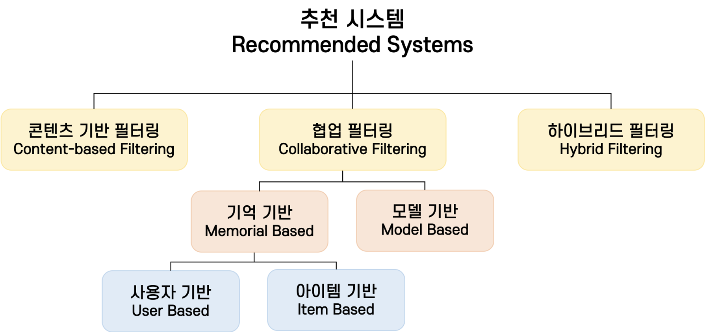
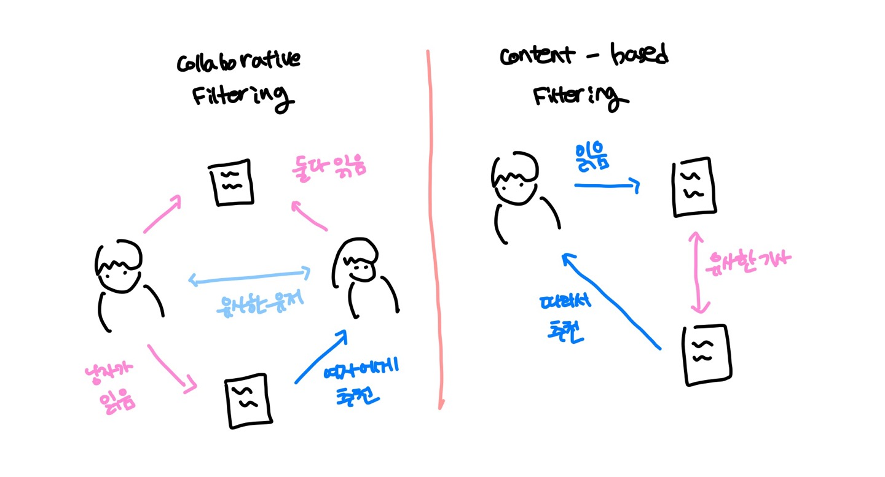

[참고 링크](https://velog.io/@jochedda/%EC%B6%94%EC%B2%9C-%EC%8B%9C%EC%8A%A4%ED%85%9C-%EC%B6%94%EC%B2%9C-%EC%95%8C%EA%B3%A0%EB%A6%AC%EC%A6%98-%EC%A2%85%EB%A5%98)

이 글을 작성할 때 참고한 블로그이다. 

## 목표

추천 시스템 목표는 다음과 같이 나눌 수 있다. 

- prediction version of problem : 학습 데이터를 통해 유저의 선호도를 정확하게 예측하는 것이 목적이다.
- ranking version of problem : 정확도보다 랭킹을 고려해서 top k 아이템을 선정하는 게 목적이다.

## 협업 필터링

2명이 비슷한 취향일 때 A의 데이터를 B에게도 추천해주는 방식 

### 기억 기반 방식

🐻**사용자 기반 추천**

**A가 피자, 햄버거, 핫도그 구매하고 B가 피자, 햄버거 구매하면 B에게 핫도그를 추천해준다.**

A랑 유사한 top k 유저들로 그룹을 구성

아이템 정보 없이 추천 가능

알고리즘 구현 비교적 간단 

🐻**아이템 기반: 크루아상과 베이글의 유사도가 높으면 크루아상 구매한 유저한테 베이글 추천**

아이템 B랑 가장 유사한 top k 아이템을 뽑아 아이템 세트 구성

사용자 정보 없이 추천 가능

신규 유저에 대한 추천 용이

### 모델 기반 방식

예측 모델의 context를 기반한 방법이다. 모델이 파라미터화 되어 있다면, 이 모델의 파라미터는 context 내에서 학습된다. 

→ context의 의미가 뭐지? 

### 한계

1) 콜드 스타트

2) 계산 효율 떨어짐

3) 롱테일: 소수 인기 콘텐츠가 전체 비율을 차지하는 현상 발생 

## 콘텐츠 기반 필터링

사용자가 과거 경험한 아이템 중 비슷한 걸 현재 시점에서 추천해줌

feature extraction, vector representation 등의 과정이 필요하다. 코사인 유사도로 유사 아이템을 선택한다. 

### 한계

콜드 스타트는 없지만 다양한 항목 추천하지는 못함. 예를 들어 음악, 사진, 영상을 동시에 추천할 때 각 항목에서 추출할 수 있는 feature가 다 달라서 profile 구성이 어려움. → 다양한 항목 추천에는 약하다.
